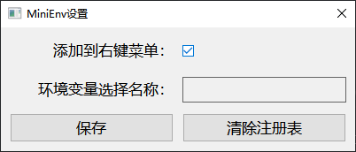
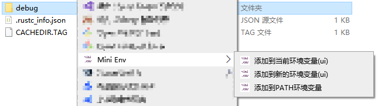
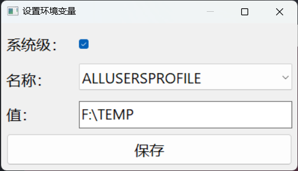
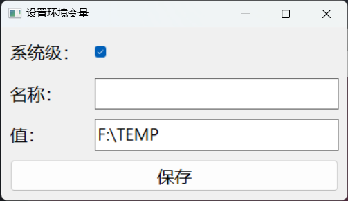

<div align="center" id="top"> 
  

  &#xa0;

  <!-- <a href="https://winapidemo.netlify.app">Demo</a> -->
</div>

<h1 align="center">Mini Env</h1>

<p align="center">
  

  

  

  

  <!--  -->

  <!--  -->

  <!--  -->
</p>

<!-- Status -->

<!-- <h4 align="center"> 
	🚧  Mini Env 🚀 Under construction...  🚧
</h4> 

<hr> -->

<p align="center">
  <a href="#dart-about">About</a> &#xa0; | &#xa0; 
  <a href="#sparkles-features">Features</a> &#xa0; | &#xa0;
  <a href="#arrow_down-install">Install</a> &#xa0; | &#xa0;
  <a href="#rocket-technologies">Technologies</a> &#xa0; | &#xa0;
  <a href="#white_check_mark-requirements">Requirements</a> &#xa0; | &#xa0;
  <a href="#checkered_flag-starting">Starting</a> &#xa0; | &#xa0;
  <a href="#memo-license">License</a> &#xa0; | &#xa0;
  <a href="https://github.com/ddki" target="_blank">Author</a>
</p>

<br>

## :dart: About ##

一个在 Windows 系统中通过右键菜单添加目录到环境变量的小工具。

## :sparkles: Features ##

:heavy_check_mark: 添加、清除右键菜单注册表;\
:heavy_check_mark: 一键添加到``PATH``（系统级）;\
:heavy_check_mark: 添加到已有环境变量;\
:heavy_check_mark: 新增自定义环境变量;

程序启动设置：



右键菜单：



添加到当前环境变量（UI）：



添加到新的环境变量（UI）：



命令：
```bash
# .\mini_env.exe --help
mini_env 0.0.1

USAGE:
    mini_env.exe [OPTIONS]

OPTIONS:
    -h, --help                 Print help information
    -k, --key <KEY>
    -m, --mode <MODE>
    -o, --operate <OPERATE>
    -v, --value <VALUE>
    -V, --version              Print version information
```

## :arrow_down: Install ##

[Release](https://github.com/ddki/windows-mini-env/releases)

## :rocket: Technologies ##

The following tools were used in this project:

- [clap](https://github.com/clap-rs/clap)
- [native-windows-gui](https://github.com/gabdube/native-windows-gui)
- [winreg](https://github.com/gentoo90/winreg-rs)
- [embed-resource](https://github.com/nabijaczleweli/rust-embed-resource)

## :white_check_mark: Requirements ##

Before starting :checkered_flag:, you need to have [Git](https://git-scm.com) and [Rust](https://www.rust-lang.org/) installed.

Rust toolchain: stable-x86_64-pc-windows-msvc;

## :checkered_flag: Starting ##

```bash
# Clone this project
$ git clone https://github.com/ddki/windows-mini-env.git

# Access
$ cd windows-mini-env

# Install dependencies && build 
$ cargo build

# Run the project
$ cargo run
```

## :memo: License ##

This project is under license from GPL-3.0. For more details, see the [LICENSE](LICENSE) file.


Made with :heart: by <a href="https://github.com/ddki" target="_blank">ddki</a>

&#xa0;

<a href="#top">Back to top</a>
